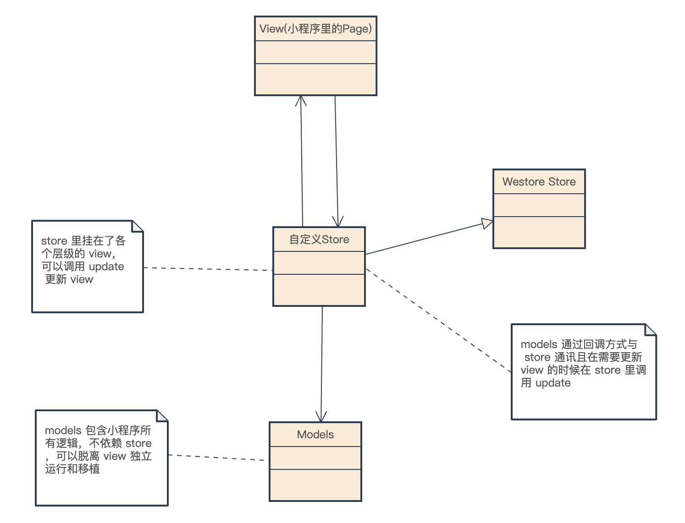

# Westore - 更好的小程序项目架构

* **Object-Oriented Programming:** Westore 强制使用面向对象程序设计，开发者起手不是直接写页面，而是使用职责驱动设计 (responsibility-driven design)的方式抽象出类、类属性和方法以及类之间的关联关系。
* **Write Once, Use Anywhere(Model):** 通过面向对象分析设计出的 Model 可以表达整个业务模型，开发者可移植 100% 的 Model 代码不带任何改动到其他环境，并使用其他渲染技术承载项目的 View，比如小程序WebView、Web浏览器、Canvas、WebGL
* **Passive View:** Westore 架构下的 View 非常薄，没有参杂任何业务逻辑，只做被动改变。



Westore 架构和 MVP 架构很相似，但是有许多不同。

* View 和 Store 是双向通讯
* View 与 Model 不发生联系，都通过 Store 传递
* View 非常薄，不部署任何业务逻辑，称为"被动视图"（Passive View），即没有任何主动性
* Store 非常薄，只复杂维护 View 需要的数据和桥接 View 和 Model
* Model 非常厚，所有逻辑都部署在那里，Model 可以脱离 Store 和 View 完整表达所有业务/游戏逻辑

随着小程序承载的项目越来越复杂，合理的架构可以提升小程序的扩展性和维护性。把逻辑写到 Page/Component 是一种罪恶，当业务逻辑变得复杂的时候 Page/Component 会变得越来越臃肿难以维护，每次需求变更如履薄冰， westore 定义了一套合理的小程序架构适用于任何复杂度的小程序，让项目底座更健壮，易维护可扩展。

## 安装

```bash
npm i westore --save
```

npm 相关问题参考：[小程序官方文档: npm 支持](https://developers.weixin.qq.com/miniprogram/dev/devtools/npm.html)

## 举个例子

> 开发如下图所示的重命名 app


按照传统的小程序开发三部曲：

* 写页面结构 wxml 
* 写页面样式 wxss
* 写页面逻辑 js/ts

省略 wxml、wxss，js 如下:

```js
Page({
  data: {
    nickName: ''
  },

  async onLoad() {
    const nickName = await remoteService.getNickName()
    this.setData({
      nickName: nickName
    })
  },

  async modifyNickName(newNickName) {
    await remoteService.modifyNickName(newNickName)
  },

  clearInput() {
    this.setData({
      nickName: ''
    })
  }
})
```

需求开发全部结束。

### 使用 Westore 重构


定义 User 实体:

```js
class User {
  constructor({ nickName, onNickNameChange }) {
    this.nickName = nickName || ''
    this.onNickNameChange = onNickNameChange || function() { }
  }

  checkNickName() {
    // 省略 nickName 规则校验
  }

  modifyNickName(nickName) {
    if(this.checkNickName(nickName) && nickName !== this.nickName) {
      this.nickName = nickName
      this.onNickNameChange(nickName)
    }
  }
}

module.exports = User
```

定义 UserStore:

```js
const { Store } = require('westore')
const User = require('../models/user')

class UserStore extends Store {
  constructor(options) {
    super()
    this.options = options
    this.data = {
      nickName: ''
    }
  }

  init() {
    const nickName = await remoteService.getNickName()
    this.user = new User({ 
      nickName,
      onNickNameChange: (newNickName)=>{
        this.data.nickName = newNickName
        this.update()
        await remoteService.modifyNickName(newNickName)
      } 
    })
  }

  async saveNickName(newNickName) {
    this.user.modifyNickName(newNickName)
  },

  modifyInputNickName(input) {
    this.data.nickName = input
    this.update()
  }
}

module.exports = new UserStore
```

页面使用 UserStore:

```js
const userStore = require('../../stores/user-store')

Page({
  data: userStore.data,

  onLoad() {
    /* 绑定 view 到 store 
      也可以给 view 取名 userStore.bind('userPage', this)
      取名之后在 store 里可通过 this.update('userPage') 更新 view
      不取名可通过 this.update() 更新 view
    */
    userStore.bind(this)
  },

  saveNickName(newNickName) {
    userStore.saveNickName(newNickName)
  },

  onInputChange(evt) {
    userStore.modifyInputNickName(evt.currentTarget.value)
  },

  clearInput() {
    userStore.modifyInputNickName('')
  }
})
```

## 官方案例目录

目录如下:

```
├─ models    // 业务模型实体
│   └─ snake-game
│       ├─ game.js
│       └─ snake.js   
│  
│  ├─ log.js
│  ├─ todo.js   
│  └─ user.js   
│
├─ pages     // 页面
│  ├─ game
│  ├─ index
│  ├─ logs   
│  └─ other.js  
│
├─ stores    // 页面的数据逻辑，page 和 models 的桥接器
│  ├─ game-store.js   
│  ├─ log-store.js      
│  ├─ other-store.js    
│  └─ user-store.js   
│
├─ utils

```

详细代码[点击这里](https://github.com/Tencent/westore/tree/master/packages/westore-example)

## 官方例子


## 贡献者

<a href="https://github.com/Tencent/westore/graphs/contributors">
  
</a>


## License

MIT 