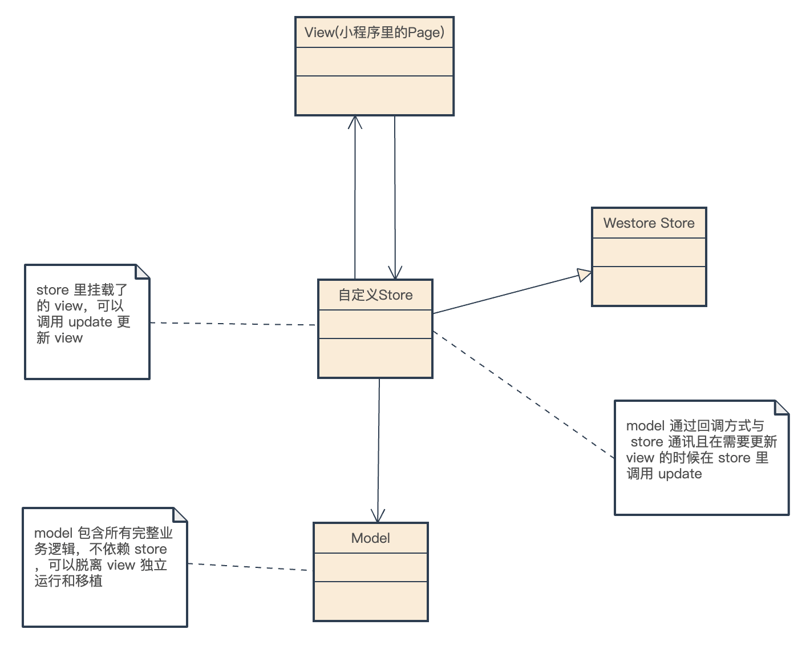
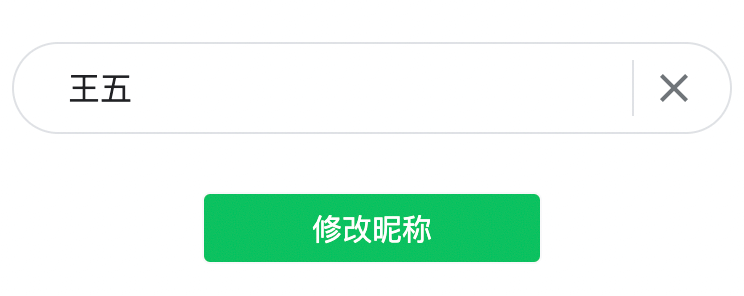
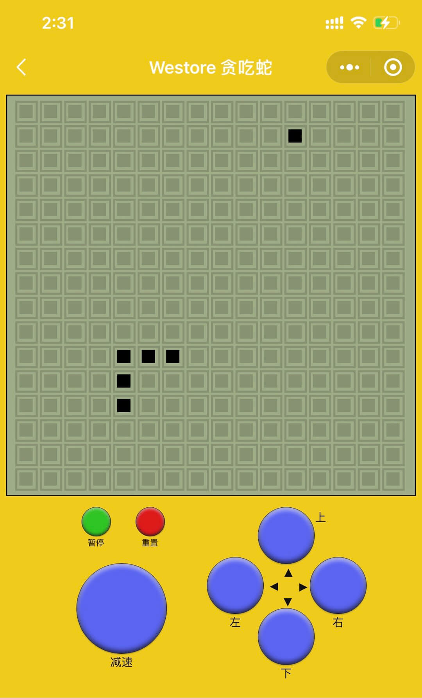
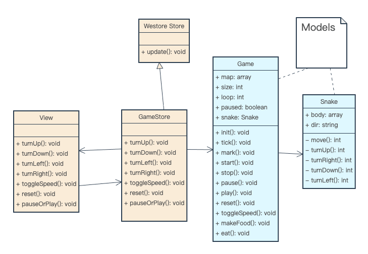
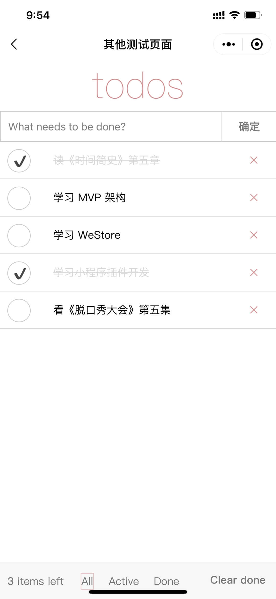
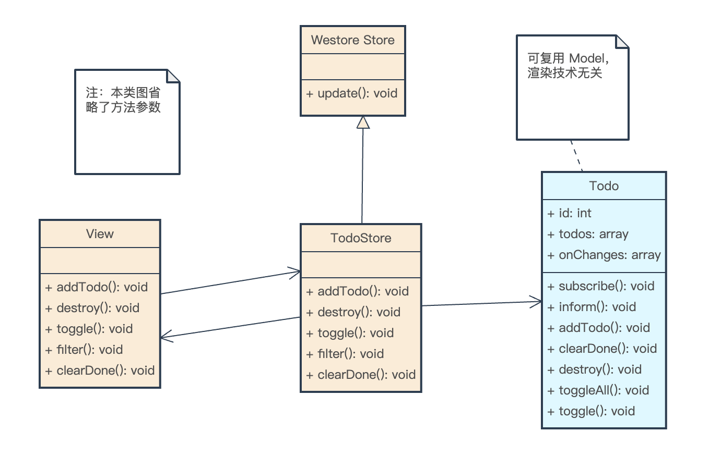
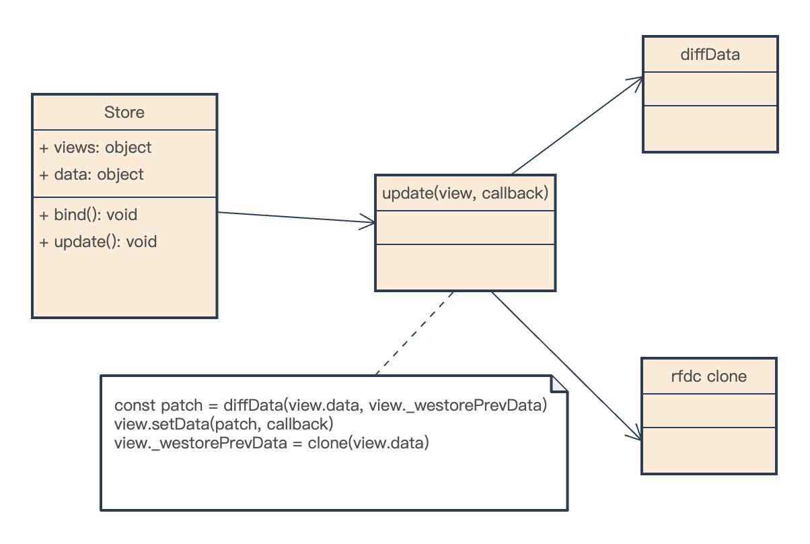

# Westore - 小程序项目分层架构

* **Object-Oriented Programming:** Westore 强制小程序使用面向对象程序设计，开发者起手不是直接写页面，而是使用职责驱动设计 (Responsibility-Driven Design)的方式抽象出类、类属性和方法以及类之间的关联关系。
* **Write Once, Use Anywhere(Model):** 通过面向对象分析设计出的 Model 可以表达整个业务模型，开发者可移植 100% 的 Model 代码不带任何改动到其他环境，并使用其他渲染技术承载项目的 View，比如小程序WebView、小游戏、Web浏览器、Canvas、WebGL。
* **Passive View:** Westore 架构下的 View 非常薄，没有参杂任何业务逻辑，只做被动改变。
* **Simple and Intuitive:** Westore 内部使用 deepClone + dataDiff 换取最短路径 `setData` 和更符合直觉的编程体验，只需 `update`，不需要再使用 `setData`。
* **Testability:** View 和 Model 之间没有直接依赖，开发者能够借助模拟对象注入测试两者中的任一方。



Westore 架构和 MVP(Model-View-Presenter) 架构很相似:

* View 和 Store 是双向通讯，View 和 Store 互相引用
* View 与 Model 不发生联系，都通过 Store 传递
* Store 引用 Model 里对象的实例，Model 不依赖 Store
* View 非常薄，不部署任何业务逻辑，称为"被动视图"（Passive View），即没有任何主动性
* Store 非常薄，只复杂维护 View 需要的数据和桥接 View 和 Model
* Model 非常厚，所有逻辑都部署在那里，Model 可以脱离 Store 和 View 完整表达所有业务/游戏逻辑

Store 层可以理解成 **中介者模式** 中的中介者，使 View 和 Model 之间的多对多关系数量减少为 0，负责中转控制视图对象 View 和模型对象 Model 之间的交互。

随着小程序承载的项目越来越复杂，合理的架构可以提升小程序的扩展性和维护性。把逻辑写到 Page/Component 是一种罪恶，当业务逻辑变得复杂的时候 Page/Component 会变得越来越臃肿难以维护，每次需求变更如履薄冰， westore 定义了一套合理的小程序架构适用于任何复杂度的小程序，让项目底座更健壮，易维护可扩展。

## 安装

```bash
npm i westore --save
```

npm 相关问题参考：[小程序官方文档: npm 支持](https://developers.weixin.qq.com/miniprogram/dev/devtools/npm.html)

## Packages

| **项目**                         | **描述**                           |
| ------------------------------- | ----------------------------------- |
| [westore](https://github.com/Tencent/westore/tree/master/packages/westore)  | westore 的核心代码 |
| [westore-example](https://github.com/Tencent/westore/tree/master/packages/westore-example) | westore 官方例子|
| [westore-example-ts](https://github.com/Tencent/westore/tree/master/packages/westore-example-ts)|  westore 官方例子(ts+scss) |

## 举个例子

> 开发如下图所示的重命名 app



按照传统的小程序开发三部曲：

* 写页面结构 wxml 
* 写页面样式 wxss
* 写页面逻辑 js/ts

省略 wxml、wxss，js 如下:

```js
Page({
  data: {
    nickName: ''
  },

  async onLoad() {
    const nickName = await remoteService.getNickName()
    this.setData({
      nickName: nickName
    })
  },

  async modifyNickName(newNickName) {
    await remoteService.modifyNickName(newNickName)
  },

  clearInput() {
    this.setData({
      nickName: ''
    })
  }
})
```

需求开发全部结束。

### 使用 Westore 重构


定义 User 实体:

```js
class User {
  constructor({ nickName, onNickNameChange }) {
    this.nickName = nickName || ''
    this.onNickNameChange = onNickNameChange || function() { }
  }

  checkNickName() {
    // 省略 nickName 规则校验
  }

  modifyNickName(nickName) {
    if(this.checkNickName(nickName) && nickName !== this.nickName) {
      this.nickName = nickName
      this.onNickNameChange(nickName)
    }
  }
}

module.exports = User
```

定义 UserStore:

```js
const { Store } = require('westore')
const User = require('../models/user')

class UserStore extends Store {
  constructor(options) {
    super()
    this.options = options
    this.data = {
      nickName: ''
    }
  }

  init() {
    const nickName = await remoteService.getNickName()
    this.user = new User({ 
      nickName,
      onNickNameChange: (newNickName)=>{
        this.data.nickName = newNickName
        this.update()
        await remoteService.modifyNickName(newNickName)
      } 
    })
  }

  async saveNickName(newNickName) {
    this.user.modifyNickName(newNickName)
  },

  modifyInputNickName(input) {
    this.data.nickName = input
    this.update()
  }
}

module.exports = new UserStore
```

页面使用 UserStore:

```js
const userStore = require('../../stores/user-store')

Page({
  data: userStore.data,

  onLoad() {
    /* 绑定 view 到 store 
      也可以给 view 取名 userStore.bind('userPage', this)
      取名之后在 store 里可通过 this.update('userPage') 更新 view
      不取名可通过 this.update() 更新 view
    */
    userStore.bind(this)
  },

  saveNickName(newNickName) {
    userStore.saveNickName(newNickName)
  },

  onInputChange(evt) {
    userStore.modifyInputNickName(evt.currentTarget.value)
  },

  clearInput() {
    userStore.modifyInputNickName('')
  }
})
```

通用 Model 是框架无关的，对于这样简单的程序甚至不值得把这种逻辑分开，但是随着需求的膨胀你会发现这么做带来的巨大好处。所以下面举一个复杂一点点的例子。

## 贪吃蛇案例

游戏截图：



设计类图：



图中浅蓝色的部分可以在小程序贪吃蛇、小游戏贪吃蛇和Web贪吃蛇项目复用，不需要更改一行代码。

## TodoApp 案例

应用截图:



设计类图：



图中浅蓝色的部分可以在小程序 TodoApp 和 Web TodoApp项目复用，不需要更改一行代码。

## 官方案例

官方例子把**贪吃蛇**和**TodoApp**做进了一个小程序目录如下:

```
├─ models    // 业务模型实体
│   └─ snake-game
│       ├─ game.js
│       └─ snake.js   
│  
│  ├─ log.js
│  ├─ todo.js   
│  └─ user.js   
│
├─ pages     // 页面
│  ├─ game
│  ├─ index
│  ├─ logs   
│  └─ other.js  
│
├─ stores    // 页面的数据逻辑，page 和 models 的桥接器
│  ├─ game-store.js   
│  ├─ log-store.js      
│  ├─ other-store.js    
│  └─ user-store.js   
│
├─ utils

```

详细代码[点击这里](https://github.com/Tencent/westore/tree/master/packages/westore-example)

扫码体验:


## 原理

### setData 去哪了？

回答 **setData 去哪了？** 之前先要思考为什么 westore 封装了这个 api，让用户不直接使用。在小程序中，通过 `setData` 改变视图。

```js
this.setData({
  'array[0].text':'changed text'
})
```

但是符合直觉的编程体验是:

```js
this.data.array[0].text = 'changed text'
```

如果 data 不是响应式的，需要手动 update:

```js
this.data.array[0].text = 'changed text'
this.update()
```

上面的编程体验是符合直觉且对开发者更友好的。所以 westore 隐藏了 setData 不直接暴露给开发者，而是内部使用 diffData 出最短更新路径，暴露给开发者的只有 update 方法。

### Diff Data

先看一下 westore [diffData](https://github.com/Tencent/westore/blob/master/packages/westore/index.esm.js#L6-L12) 的能力:

``` js
diff({
    a: 1, b: 2, c: "str", d: { e: [2, { a: 4 }, 5] }, f: true, h: [1], g: { a: [1, 2], j: 111 }
}, {
    a: [], b: "aa", c: 3, d: { e: [3, { a: 3 }] }, f: false, h: [1, 2], g: { a: [1, 1, 1], i: "delete" }, k: 'del'
})
```

Diff 的结果是:

``` js
{ "a": 1, "b": 2, "c": "str", "d.e[0]": 2, "d.e[1].a": 4, "d.e[2]": 5, "f": true, "h": [1], "g.a": [1, 2], "g.j": 111, "g.i": null, "k": null }
```


Diff 原理:

* 同步所有 key 到当前 store.data
* 携带 path 和 result 递归遍历对比所有 key value

``` js
export function diffData(current, previous) {
  const result = {}
  if (!previous) return current
  syncKeys(current, previous)
  _diff(current, previous, '', result)
  return result
}
```

同步上一轮 state.data 的 key 主要是为了检测 array 中删除的元素或者 obj 中删除的 key。

### Westore 实现细节



提升编程体验的同时，也规避了每次 setData 都传递大量新数据的问题，因为每次 diff 之后的 patch 都是 setData 的最短路径更新。

所以没使用 westore 的时候经常可以看到这样的代码:


使用完 westore 之后:

```js
this.data.a.b[1].c = 'f'
this.update()
```

## 小结

从目前来看，绝大部分的小程序项目都把业务逻辑堆积在小程序的 Page 构造函数里，可读性基本没有，给后期的维护带来了巨大的成本，westore 架构的目标把业务/游戏逻辑解耦出去，Page 就是纯粹的 Page，它只负责展示和接收用户的输入、点击、滑动、长按或者其他手势指令，把指令中转给 store，store 再去调用真正的程序逻辑 model，这种分层边界清晰，维护性、扩展性和可测试性极强，单个文件模块大小也能控制得非常合适。

## 贡献者

<a href="https://github.com/Tencent/westore/graphs/contributors">
  
</a>


## License

MIT 
