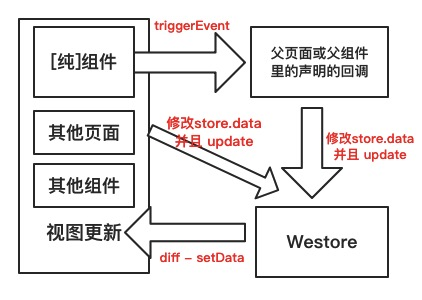
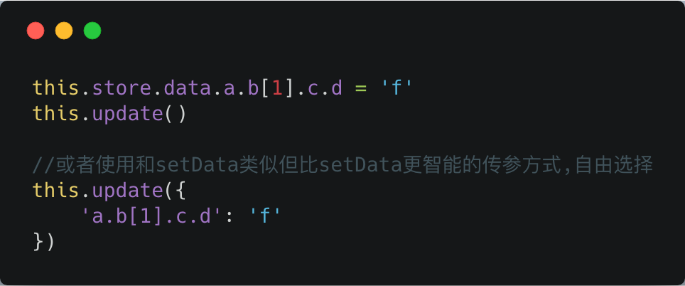
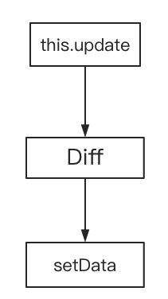

# Westore - 微信小程序解决方案

> [1KB javascript](https://github.com/dntzhang/westore/blob/v1/packages/westore/utils/create.js)覆盖状态管理、跨页通讯、插件开发和云数据库开发

---

- [omix](https://github.com/Tencent/omi/tree/master/packages/omix) - westore 进化版
- [dd-store](https://github.com/linjc/dd-store) - 钉钉E应用状态管理, westore 灵感衍生而来
- [Packages 简介](#packages-简介)
- [前言](#前言)
- [云开发](./westore-cloud.md)
- [插件开发](./westore-plugin.md)
- [普通开发](#普通开发)
	- [定义全局 store](#定义全局-store)
  - [创建页面](#创建页面)
  - [绑定数据](#绑定数据)
  - [更新页面](#更新页面)
  - [创建组件](#创建组件)
  - [更新组件](#更新组件)
  - [setData 和 update 对比](#setdata-和-update-对比)
  - [跨页面同步数据](#跨页面同步数据)
  - [纯组件](#纯组件)
  - [调试](#调试)
  - [超大型小程序最佳实践](#超大型小程序最佳实践两种方案)
- [API](#api)
- [注意事项](#注意事项)
- [原理](#原理)
  - [JSON Diff](#json-diff)
  - [Update](#update)
  - [函数属性](#函数属性)
- [License](#license)


## Packages 简介

| Package | 介绍  |
| ------ | ------  |
| westore | 	小程序演示项目	  |
| westore-cloud  | 小程序 + 腾讯云演示项目(隐形云☁️)	  |
| westore-plugin | 小程序插件开发演示项目  |
| westore-proxy | 小程序底层使用 Proxy 演示项目	  |
| westore-test  |  测试 westore API 的小程序  |
| ~~westore-web~~ 已转移至 [omi-mp](https://github.com/Tencent/omi/tree/master/packages/omi-mp)|  小程序开发 Web 的项目  |

## 前言

众所周知，小程序通过页面或组件各自的 setData 再加上各种父子、祖孙、姐弟、姑姑与堂兄等等组件间的通讯会把程序搞成一团浆糊，如果再加上跨页面之间的组件通讯，会让程序非常难维护和调试。虽然市面上出现了许多技术栈编译转小程序的技术，但是我觉没有戳中小程序的痛点。小程序不管从组件化、开发、调试、发布、灰度、回滚、上报、统计、监控和最近的云能力都非常完善，小程序的工程化简直就是前端的典范。而开发者工具也在持续更新，可以想象的未来，组件布局的话未必需要写代码了。而且据统计，开发小程序使用最多的技术栈是使用小程序本身的开发工具和语法，所以最大的痛点只剩下状态管理和跨页通讯。Westore 的方案:



非纯组件的话，可以直接省去 triggerEvent 的过程，直接修改 store.data 并且 update，形成缩减版单向数据流。

受 [Omi 框架](https://github.com/Tencent/omi) 的启发，且专门为小程序开发的 [JSON Diff 库](https://github.com/dntzhang/westore/blob/v1/packages/westore/utils/diff.js)，所以有了 westore 全局状态管理和跨页通讯框架让一切尽在掌握中，且受高性能 JSON Diff 库的利好，长列表滚动加载显示变得轻松可驾驭。总结下来有如下特性和优势:

* 和 Omi 同样简洁的 Store API
* 超小的代码尺寸(包括 json diff 共100多行)
* 尊重且顺从小程序的设计(其他转译库相当于反其道行)
* 增强 data 数据绑定，函数属性可直接绑定到 WXML
* this.update 和 setData 语法类似，但返回一个Promise
* this.update 比原生 setData 的性能更优，更加智能
* Westore 专为小程序插件开发[定制了模板](https://github.com/dntzhang/westore/tree/master/packages/westore-plugin)
* Westore 集成了腾讯云开发

总结下小程序的痛点:

* 使用 this.data 可以获取内部数据和属性值，但不要直接修改它们，应使用 setData 修改
* setData 编程体验不好，很多场景直接赋值更加直观方便
* setData 卡卡卡慢慢慢，JsCore 和 Webview 数据对象来回传浪费计算资源和内存资源
* 组件间通讯或跨页通讯会把程序搞得乱七八糟，变得极难维护和扩展

所以没使用 westore 的时候经常可以看到这样的代码:


使用完 westore 之后:



上面两种方式也可以混合使用。

可以看到，westore 不仅支持直接赋值，而且 this.update 兼容了 this.setData 的语法，但性能大大优于 this.setData，再举个例子：

``` js
this.store.data.motto = 'Hello Westore'
this.store.data.b.arr.push({ name: 'ccc' })
this.update()
```

等同于

``` js
this.update({
  motto:'Hello Westore',
  [`b.arr[${this.store.data.b.arr.length}]`]:{name:'ccc'}
})
```

和小程序的setData不同的是回调的方式，小程序的回调为setData的第二个入参，但是update则直接返回一个Promise，并且返回的数据内有更新的数据内容。例如：

``` js
this.setData({
  motto: 'Hello Westore'
}, () => {
  console.log('the motto has been set')
})
```

被改进为

``` js
this.store.data.mottto = 'Hello Westore'
this.update().then(diff => {
  console.log('the motto has been set', diff)
})
```

这里需要特别强调，虽然 this.update 可以兼容小程序的 this.setData 的方式传参，但是更加智能，this.update 会先 Diff 然后 setData。原理:



## API

Westore API 只有六个, 大道至简:

* create(store, option) 创建页面
* create(option)        创建组件
* this.update([data])   更新页面或组件，其中 data 为可选，data 的格式和 setData 一致
* store.update([data])   更新页面或组件，在非页面非组件的 js 文件中使用
* store.method(path, fn)   更新或扩展函数属性，注意这里不能直接赋值的方式修改函数属性，需要使用 store.method
* store.onChange = fn   监听 store data 的变化回调，一般可在里面写一些上报或监控数据变化的其他公共逻辑

纯组件使用小程序自带的 Component，或使用 `create({ pure: true })`。create的方式可以使用 update 方法，Component 方式不行。

## 普通开发

### 定义全局 store

```js
export default {
  data: {
    motto: 'Hello World',
    userInfo: {},
    hasUserInfo: false,
    canIUse: wx.canIUse('button.open-type.getUserInfo'),
    logs: [],
    b: {
      arr: [{ name: '数值项目1' }] ,
      //深层节点也支持函数属性
      fnTest:function(){
        return this.motto.split('').reverse().join('')
      }
    },
    firstName: 'dnt',
    lastName: 'zhang',
    fullName: function () {
      return this.firstName + this.lastName
    },
    pureProp: 'pureProp',
    globalPropTest: 'abc', //更改我会刷新所有页面,不需要在组件和页面声明data依赖
    ccc: { ddd: 1 } //更改我会刷新所有页面,不需要在组件和页面声明data依赖
  },
  globalData: ['globalPropTest', 'ccc.ddd'],
  logMotto: function () {
    console.log(this.data.motto)
  },
  //默认 false，为 true 会无脑更新所有实例
  //updateAll: true
}
```

页面和组件上同样需要声明依赖的 data，这样 westore 会按需局部更新。如 Page 的 data：

```js
data: {
  motto: null,
  userInfo: null,
  hasUserInfo: null,
  canIUse: null,
  b: { arr: [ ] },
  firstName: null,
  lastName: null,
  fullName: null,
  pureProp: null,
  //privateProp 你也可以定义 store.data 没有的属性，该属性的变更只能通过 this.setData 进行更新视图
  privateProp: '私有数据',
  xxxx: '私有数据2'
}
```

页面和组件上声明的 data 的值会被 store 上的值覆盖掉。所以页面和组件默认值在 store.data 上标记，而不是在组件和页面的 data。纯组件在组件内部的 data 定义默认值。所以归纳一下：

* store.data 用来列出所有属性和默认值
* 组件的私有 data 也可以放在自身的 data 上，不用挂在 store.data 上，但是不能通过 this.update 更新，只能通过 setData
* 组件和页面的 data 用来列出依赖的 store.data 的属性 (westore会记录path)，按需更新
* 如果小程序页面和组件很少，可以 updateAll 设置成 true，并且组件和页面不需要声明 data，也就不会按需更新
* 纯组件的 data 和 store.data 没有关系，所有其 data 用来列出所有属性和默认值
* globalData 里声明的 path，只要修改了对应 path 的值，就会刷新所有页面和组件

比起原生小程序增强的功能是提供了 data 函数属性，比如上面的 fullName，在小程序 WXML 直接绑定：

```jsx
<view>{{fullName}}</view>
```

### 创建页面

```js
import store from '../../store'
import create from '../../utils/create'

const app = getApp()

create(store, {
  //只是用来给 westore 生成依赖 path 局部更新
  data: {
    motto: null,
    userInfo: null,
    hasUserInfo: null,
    canIUse: null,
    b: { arr: [ ] },
    firstName: null,
    lastName: null,
    fullName: null,
    pureProp: null
  },
  onLoad: function () {
    if (app.globalData.userInfo) {
      this.store.data.userInfo = app.globalData.userInfo
      this.store.data.hasUserInfo = true
      this.update()
    } else if (this.data.canIUse) {
      app.userInfoReadyCallback = res => {
        this.store.data.userInfo = res.userInfo
        this.store.data.hasUserInfo = true
        this.update()
      }
    } else {
      wx.getUserInfo({
        success: res => {
          app.globalData.userInfo = res.userInfo
          this.store.data.userInfo = res.userInfo
          this.store.data.hasUserInfo = true
          this.update()
        }
      })
    }
  }

})
```

创建 Page 只需传入两个参数，store 从根节点注入，所有子组件都能通过 this.store 访问。

### 绑定数据

```jsx
<view class="container">

  <view class="userinfo">
    <button wx:if="{{!hasUserInfo && canIUse}}" open-type="getUserInfo" bindgetuserinfo="getUserInfo"> 获取头像昵称 </button>
    <block wx:else>
      <image bindtap="bindViewTap" class="userinfo-avatar" src="{{userInfo.avatarUrl}}" mode="cover"></image>
      <text class="userinfo-nickname">{{userInfo.nickName}}</text>
    </block>
  </view>
  <view class="usermotto">
    <text class="user-motto">{{motto}}</text>
  </view>
  <view>{{fullName}}</view>
  <hello></hello>
</view>
```

和以前的写法没有差别，直接把 `store.data` 作为绑定数据源。  
data 的函数属性也可以直接绑定，但别忘了要在页面上声明相应的函数属性依赖。

### 更新页面

```js
this.store.data.any_prop_you_want_to_change = 'any_thing_you_want_change_to'
this.update()
```

### 创建组件

```js

import create from '../../utils/create'

create({
  ready: function () {
   //you can use this.store here
  },

  methods: {
    //you can use this.store here
  }
})

```
和创建 Page 不一样的是，创建组件只需传入一个参数，不需要传入 store，因为已经从根节点注入了。

### 更新组件

```js
this.store.data.any_prop_you_want_to_change = 'any_thing_you_want_change_to'
this.update()
```

### setData 和 update 对比

拿官方模板示例的 log 页面作为例子:

```js
this.setData({
  logs: (wx.getStorageSync('logs') || []).map(log => {
    return util.formatTime(new Date(log))
  })
}, () => {
  console.log('setData完成了')
})
```

使用 westore 后:

``` js
this.store.data.logs = (wx.getStorageSync('logs') || []).map(log => {
  return util.formatTime(new Date(log))
})
this.update().then(diff => {
  console.log('setData完成了')
  console.log('更新内容为', diff)
})
```

看似一条语句变成了两条语句，但是 this.update 调用的 setData 是 diff 后的，所以传递的数据更少。

### 跨页面同步数据

使用 westore 你不用关心跨页数据同步，你只需要专注 this.store.data 便可，修改完在任意地方调用 update 便可：

```js
this.update()
```

### 纯组件

这里说的组件便是自定义组件，使用原生小程序的开发格式如下:

```js

Component({
  properties: { },

  data: { },

  methods: { }
})
```

使用 Westore 之后:

```js
import create from '../../utils/create'

create({
  properties: { },

  data: { },

  methods: { }
})
```

看着差别不大，但是区别：

* Component 的方式使用 setData 更新视图
* create 的方式直接更改 store.data 然后调用 update
* create 的方式可以使用函数属性，Component 不可以，如：

```js
export default {
  data: {
    firstName: 'dnt',
    lastName: 'zhang',
    fullName:function(){
      return this.firstName + this.lastName
    }
  }
}
```

绑定到视图:

```jsx
<view>{{fullName}}</view>
```

有一些组件区别于业务组件，叫纯组件。如 tip、alert、dialog、pager、日历等，与业务数据无直接耦合关系。
组件的显示状态由传入的 props 决定，与外界的通讯通过内部 triggerEvent 暴露的回调。
triggerEvent 的回调函数可以改变全局状态，实现单向数据流同步所有状态给其他兄弟、堂兄、姑姑等组件或者其他页面。

Westore里可以使用 `create({ pure: true })` 创建纯组件（当然也可以直接使用 Component），比如 ：

```js

import create from '../../utils/create'

create({
  pure : true,

  properties: {
    text: {
      type: String,
      value: '',
      observer(newValue, oldValue) { }
    }
  },

  data: {
    privateData: 'privateData'
  },

  ready: function () {
    console.log(this.properties.text)
  },

  methods: {
    onTap: function(){
      this.store.data.privateData = '成功修改 privateData'
      this.update()
      this.triggerEvent('random', {rd:'成功发起单向数据流' + Math.floor( Math.random()*1000)})
    }
  }
})
```

需要注意的是，加上 `pure : true` 之后就是纯组件，组件的 data 不会被合并到全局的 store.data 上。

组件区分业务组件和纯组件，他们的区别如下：

* 业务组件与业务数据紧耦合，换一个项目可能该组件就用不上，除非非常类似的项目
* 业务组件通过 store 获得所需参数，通过更改 store 与外界通讯
* 业务组件也可以通过 props 获得所需参数，通过 triggerEvent 与外界通讯
* 纯组件与业务数据无关，可移植和复用
* 纯组件只能通过 props 获得所需参数，通过 triggerEvent 与外界通讯

大型项目一定会包含纯组件、业务组件。通过纯组件，可以很好理解单向数据流:


### 调试

```js
console.log(getApp().globalData.store.data)
```

### 超大型小程序最佳实践(两种方案)

不排除小程序被做大得可能，接触的最大的小程序有 60+ 的页面，所以怎么管理？这里给出了两个最佳实践方案。

* 第一种方案，拆分 store 的 data 为不同模块，如:

```js
export default {
  data: {
    commonA: 'a',
    commonB: 'b',
    pageA: {
      a: 1
      xx: 'xxx'
    },
    pageB: {
      b: 2,
      c: 3
    }
  },
  xxx: function () {
    console.log(this.data)
  }
}
```

* 第二种方案，拆分 store 的 data 到不同文件且合并到一个 store 暴露给 create 方法，如：

a.js

```js
export default {
  data: {
    a: 1
    xx: 'xxx'
  },
  aMethod: function (num) {
    this.data.a += num
  }
}
```

b.js


```js
export default {
  data: {
    b: 2,
    c: 3
  },
  bMethod: function () {

  }
}
```

store.js

```js
import a from 'a.js'
import b from 'b.js'

export default {
  data: {
    commonNum: 1,
    commonB: 'b',
    pageA: a.data
    pageB: b.data
  },
  xxx: function () {
    //you can call the methods of a or b and can pass args to them
    console.log(a.aMethod(commonNum))
  },
  xx: function(){

  }
}
```

当然，也可以不用按照页面拆分文件或模块，也可以按照领域来拆分，这个很自由，视情况而定。

## 注意事项

解决元素组件状态不同步的问题，比如 switch 需要通过绑定 bindtap 去记录状态，不然无法 diff 出更改：

```html
<switch bindtap='switchTap' checked="{{value}}"></switch>
```

```js
  switchTap() {
    this.store.data.value = !this.store.data.value
    this.update()
  },
  restore() {
    this.store.data.value = true
    this.update()
  }
```

原本是用户交互状态不影响 data 的，需要特别注意同步 data 到 store.data，不然无法 diff 出 patch，多谢 @i7soft。

## 原理

```
 ---------------       -------------------        -----------------------
| this.update  |  →  |     json diff     |   →  | setData()-setData()...|  →  之后就是黑盒(小程序官方实现，但是 dom/apply diff 肯定是少不了)
 ---------------       -------------------        -----------------------
```

虽然和 Omi 一样同为 this.update 但是却有着本质的区别。Omi 的如下:

```
 ---------------       -------------------        ----------------         ------------------------------
|  this.update  |  →  |     setState      |   →  |  jsx rerender  |   →   |   vdom diff → apply diff...  |
 ---------------       -------------------        ----------------         ------------------------------
```

都是数据驱动视图，但本质不同，原因:

* 小程序 store 和 dom 不在同一个环境，先在 js 环境进行 json diff，然后使用 diff 结果通过 setData 通讯告诉 webview
* Web 里使用 omi 的话 store 和 dom 在同一环境，setState 直接驱动的 vdom diff 然后把 diff 结果作用在真实 dom 上
* Native 里使用 omi 的话，omi 通过 jsbridge 向 客户端发送的是 dom 指令而非 数据

### JSON Diff

先看一下我为 westore 专门定制开发的 [JSON Diff 库](https://github.com/dntzhang/westore/blob/v1/packages/westore/utils/diff.js) 的能力:

``` js
diff({
    a: 1, b: 2, c: "str", d: { e: [2, { a: 4 }, 5] }, f: true, h: [1], g: { a: [1, 2], j: 111 }
}, {
    a: [], b: "aa", c: 3, d: { e: [3, { a: 3 }] }, f: false, h: [1, 2], g: { a: [1, 1, 1], i: "delete" }, k: 'del'
})
```

Diff 的结果是:

``` js
{ "a": 1, "b": 2, "c": "str", "d.e[0]": 2, "d.e[1].a": 4, "d.e[2]": 5, "f": true, "h": [1], "g.a": [1, 2], "g.j": 111, "g.i": null, "k": null }
```


Diff 原理:

* 同步所有 key 到当前 store.data
* 携带 path 和 result 递归遍历对比所有 key value

``` js
export default function diff(current, pre) {
    const result = {}
    syncKeys(current, pre)
    _diff(current, pre, '', result)
    return result
}
```

同步上一轮 state.data 的 key 主要是为了检测 array 中删除的元素或者 obj 中删除的 key。

### 小程序 setData

setData 是小程序开发中使用最频繁的接口，也是最容易引发性能问题的接口。在介绍常见的错误用法前，先简单介绍一下 setData 背后的工作原理。setData 函数用于将数据从逻辑层发送到视图层（异步），同时改变对应的 this.data 的值（同步）。

其中 key 可以以数据路径的形式给出，支持改变数组中的某一项或对象的某个属性，如 array[2].message，a.b.c.d，并且不需要在 this.data 中预先定义。比如：

```js
this.setData({
      'array[0].text':'changed data'
})
```

所以 diff 的结果可以直接传递给 `setData`，也就是 `this.update`。

#### setData 工作原理

小程序的视图层目前使用 WebView 作为渲染载体，而逻辑层是由独立的 JavascriptCore 作为运行环境。在架构上，WebView 和 JavascriptCore 都是独立的模块，并不具备数据直接共享的通道。当前，视图层和逻辑层的数据传输，实际上通过两边提供的 evaluateJavascript 所实现。即用户传输的数据，需要将其转换为字符串形式传递，同时把转换后的数据内容拼接成一份 JS 脚本，再通过执行 JS 脚本的形式传递到两边独立环境。

而 evaluateJavascript 的执行会受很多方面的影响，数据到达视图层并不是实时的。

常见的 setData 操作错误:

* 频繁的去 setData
* 每次 setData 都传递大量新数据
* 后台态页面进行 setData

上面是官方截取的内容。使用 webstore 的 this.update 本质是先 diff，再执行一连串的 setData，所以可以保证传递的数据每次维持在最小。既然可以使得传递数据最小，所以第一点和第三点虽有违反但可以商榷。

### Update

#### 页面生命周期函数

| 名称 | 描述  |
| ------ | ------  |
| onLoad | 	监听页面加载	  |
| onShow | 监听页面显示	  |
| onReady | 监听页面初次渲染完成  |
| onHide | 监听页面隐藏	  |
| onUnload | 监听页面卸载  |

### 组件生命周期函数

| 名称 | 描述  |
| ------ | ------  |
| created | 	在组件实例进入页面节点树时执行，注意此时不能调用 setData	  |
| attached | 在组件实例进入页面节点树时执行	  |
| ready | 在组件布局完成后执行，此时可以获取节点信息（使用 SelectorQuery ）	  |
| moved | 在组件实例被移动到节点树另一个位置时执行	  |
| detached | 在组件实例被从页面节点树移除时执行  |

这里区分在页面中的 update 和 组件中的 update。页面中的 update 在 onLoad 事件中进行实例收集。

```js
const onLoad = option.onLoad
option.onLoad = function () {
    this.store = store
    rewriteUpdate(this)
    store.instances[this.route] = []
    store.instances[this.route].push(this)
    onLoad && onLoad.call(this)
}
Page(option)
```

组件中的 update 在 ready 事件中进行行实例收集:

```js
const ready = store.ready
store.ready = function () {
    this.page = getCurrentPages()[getCurrentPages().length - 1]
    this.store = this.page.store
    this.setData.call(this, this.store.data)
    rewriteUpdate(this)
    this.store.instances[this.page.route].push(this)
    ready && ready.call(this)
}
Component(store)
```

rewriteUpdate 的实现如下:

``` js
function rewriteUpdate(ctx) {
    ctx.update = (patch) => {
        let needDiff = false
        let diffResult = patch
        if (patch) {
            for (let key in patch) {
                updateByPath(ctx.store.data, key, patch[key])
                if (typeof patch[key] === 'object') {
                    needDiff = true
                }
            }
        } else {
            needDiff = true
        }
        if (needDiff) {
            diffResult = diff(ctx.store.data, originData)
        }
        for (let key in ctx.store.instances) {
            ctx.store.instances[key].forEach(ins => {
                ins.setData.call(ins, diffResult)
            })
        }
        ctx.store.onChange && ctx.store.onChange(diffResult)
        for (let key in diffResult) {
            updateByPath(originData, key, diffResult[key])
        }
    }
}
```

westore 会收集所有页面和组件的实例，在开发者执行 this.update 的时候遍历所有实例进行 setData。

### 函数属性

``` js
function defineFnProp(data) {
    Object.keys(data).forEach(key => {
        const fn = data[key]
        if (typeof fn == 'function') {
            fnMapping[key] = fn
            Object.defineProperty(globalStore.data, key, {
                enumerable: true,
                get: () => {
                    return fnMapping[key].call(globalStore.data)
                },
                set: (value) => {
                    fnMapping[key] = value
                }
            })
        }
    })
}
```

通过 defineProperty 重写了属性的 get 和 set，fnMapping 存放所有 key 和函数的映射。这里一定要设置 enumerable 为 true，因为 diff 的时候需要遍历。

## License
MIT [@dntzhang](https://github.com/dntzhang)
