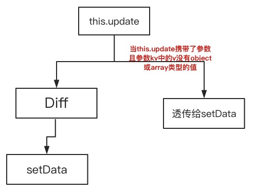

## Westore 最近更新

Westore 开源两天就突破了 1000 star，受到了海量关注，收到了大量的中肯和实用的反馈和意见。小程序插件开发的诉求是非常重要的意见之一。

先回顾一下小程序现有的痛点:

* 使用 this.data 可以获取内部数据和属性值，但不要直接修改它们，应使用 setData 修改
* setData 编程体验不好，很多场景直接赋值更加直观方便
* setData 卡卡卡慢慢慢，JsCore 和 Webview 数据对象来回传浪费计算资源和内存资源
* 组件间通讯或跨页通讯会把程序搞得乱七八糟，变得极难维护和扩展 

所以没使用 westore 的时候经常可以看到这样的代码:


使用 Westore 对编程体验的改善:


上面两种方式也可以混合使用。

这里需要特别强调，虽然 this.update 可以兼容小程序的 this.setData 的方式传参，但是更加智能，this.update 会按需 Diff 或者 透传给 setData。原理:



再举个例子：

``` js
this.store.data.motto = 'Hello Store222'
this.store.data.b.arr.push({ name: 'ccc' })
this.update()
```

等同于

``` js
this.update({
  motto:'Hello Store222',
  [`b.arr[${this.store.data.b.arr.length}]`]:{name:'ccc'}
})
```